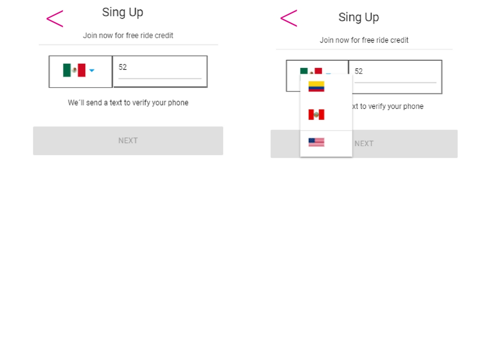

##  L Y F T

1.  Web-app que el usuario pueda registrarse.

2. En la siguiente vista tenemos un boton que nos permita inicializa el registro y nos mande ala siguiente vista.

 

3. Usuario puede escoger el país y debe ingresar su número de teléfono con 10 digitos y validarlo para que nos permita ingresar ala siguiente vista.

 

4. Una vez ingresado el número de teléfono se habilita el botón y al dar click debe enviar una alerta con un código generado aleatoriamente (LAB-000) y redireccionar a la siguiente vista.

 

5. En esta vista se debe ingresar el código dado anteriormente y podras obtener otro numero despues de ingresar se activara el boton.

 

6. Para ingresar sus datos necesitamos un formulario que le pida su nombre, apellido y correo electrónico. Deberá también tener un checkbox para que se acepten los términos y condiciones del servicio.

   

7. En esta vista mostraremos al usuario que le indique que ha concluido con el registro exitosamente.

   

   
